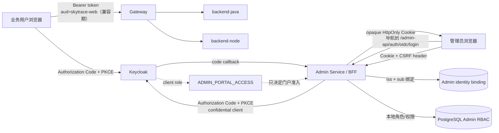
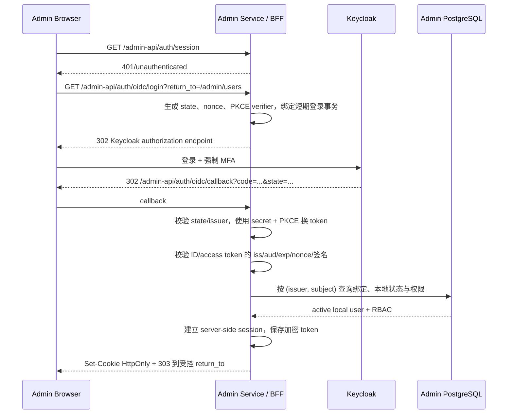

# 02. 目标架构与信任边界

实施状态：**规划文档，目标架构未实施；实现和部署文件只有注释变更**

## 1. 目标原则

目标架构遵循六个原则：

1. 一个常规身份源：用户凭据、MFA、登录风控和 SSO 只由 Keycloak 管理。
2. 两个交互入口：业务平台与管理平台使用独立 client、redirect URI、会话策略和 audience。
3. 多个资源边界：每个资源服务只接受明确发给自己的 token，不因 issuer 相同而互相信任。
4. 授权就近决策：业务角色由业务服务判定；Admin 细粒度权限由 Admin Service 本地 RBAC 判定。
5. 管理 token 不进入 JavaScript：Admin Service 作为 BFF 保管 Keycloak token，浏览器只持有不透明会话 Cookie。
6. 默认拒绝：配置缺失、身份未绑定、MFA 不足、audience 不符、权限缓存故障都不能降级为放行。

### 1.1 为什么最终选择 BFF，而不是直接复制业务 SPA 模式

| 方案 | 身份是否统一 | token 是否暴露给 Admin JavaScript | 新增复杂度 | 本方案定位 |
| --- | --- | --- | --- | --- |
| 保留本地密码/JWT | 否 | access/refresh 都在 localStorage | 当前已有，但安全债务高 | 淘汰 |
| Admin public SPA + Code/PKCE | 是 | 是，但可只存内存 | 较低 | 仅受阻时的限时桥接 |
| Token-mediating backend | 是 | access token 仍返回浏览器 | 中等 | 不选；安全收益不如完整 BFF |
| Admin confidential BFF | 是 | 否 | 较高，需 Cookie/CSRF/session | 最终目标 |

项目已经具备独立 `admin-service`，且 `admin-frontend/nginx.conf` 将 `/admin-api` 以同源方式代理给该服务。对于可以创建/禁用用户、修改角色和清理日志的高权限入口，直接完成 BFF 比先做 public SPA、再进行第二次会话迁移更合适。若团队当前无法可靠运维服务端 session 和 CSRF，才采用本文第 12 节的限时桥接方案。

## 2. 目标组件图



图中的业务 audience `skytrace-web` 是当前兼容值；长期将 client 和 resource audience 解耦为 `skytrace-business-api`，见 [08. 后续演进方向](08-future-directions.md)。本次 Admin 改造不应捆绑业务 audience 迁移。

## 3. 身份域、客户端和 audience

### 3.1 推荐对象

| 对象 | 类型 | 用途 | 是否持有 secret | 允许的入口 |
| --- | --- | --- | --- | --- |
| `skytrace-web` | public OIDC client | 业务 Vue SPA | 否 | 业务 HTTPS origin 的精确 callback |
| `skytrace-admin` | confidential OIDC client | Admin Service BFF | 是，仅服务器 | Admin Service 的精确 callback |
| `skytrace-service` | confidential service account | 现有业务自动化 | 是，仅服务器 | token endpoint，无浏览器 flow |
| `skytrace-admin-automation` | 候选 confidential client | 未来受控管理自动化 | 是，仅自动化平台 | 不启用 browser flow |
| `skytrace-admin-api` | resource client/audience namespace | 标识 Admin API token 接收方，并承载 `ADMIN_PORTAL_ACCESS` client role | 不适用 | 仅 Admin Service |

不要通过切换同一个 Keycloak client 的 public/confidential 属性来支持两种模式。若过渡期采用直接 SPA PKCE，应另建临时 public client `skytrace-admin-spa-transition`，并在 BFF 切换完成后删除。

### 3.2 为什么 client ID 与 audience 分开

client 表示“谁申请 token”，audience 表示“token 发给谁使用”。当前业务 client 与 audience 都叫 `skytrace-web`，可以暂时兼容，但新的管理端应从一开始区分：

```text
azp/client_id = skytrace-admin
aud           = skytrace-admin-api
```

Admin Service 必须校验 audience。只检查签名和 issuer，会导致同一 realm 中为其他应用签发的 token 被横向复用。

### 3.3 接受矩阵

| Token 来源 | Gateway 业务 API | backend-java | backend-node | Admin Service 浏览器通道 | Admin Service 机器通道 |
| --- | --- | --- | --- | --- | --- |
| `skytrace-web`, `aud=skytrace-web` | 接受 | 接受 | 接受 | 拒绝 | 拒绝 |
| `skytrace-admin`, `aud=skytrace-admin-api` | 默认拒绝 | 默认拒绝 | 默认拒绝 | token 仅由 BFF 内部使用 | 不适用 |
| `skytrace-service`, 业务 audience | 按现有角色接受 | 按现有角色接受 | 按现有角色接受 | 拒绝 | 拒绝 |
| `skytrace-admin-automation`, Admin audience | 拒绝 | 拒绝 | 拒绝 | 不创建浏览器 session | 明确启用后才接受 |
| 当前 Admin HS256 本地 JWT | 拒绝 | 拒绝 | 拒绝 | 仅 dual 迁移期接受 | 迁移后拒绝 |

“默认拒绝”不等于永远禁止跨域能力。如果以后管理操作确实需要调用业务 API，应由 Admin Service 以受控服务身份调用，或使用 token exchange/downscoped token，并为具体场景写单独 ADR；不能把管理 token 直接变成万能 token。

## 4. Admin BFF 登录流程

### 4.1 首次登录



关键要求：

- `return_to` 只能是站内相对路径，不能接受任意 URL。
- `state`、`nonce`、PKCE verifier 必须每次随机生成、单次使用、短期有效并绑定同一浏览器登录事务。
- callback 必须拒绝缺少或重复使用的 state、issuer mix-up、nonce 不匹配和 code replay。
- code exchange 发生在 Admin Service，client secret 绝不进入浏览器或静态资源。
- Keycloak 已认证但未绑定的用户返回稳定的 403/待审批状态，不能自动创建管理员。
- 本地 status 为 disabled 时，即使 Keycloak session 有效也拒绝。

### 4.2 已登录 API 请求

```text
浏览器
  -> Cookie: __Host-Http-skytrace-admin-session=<opaque-id>
  -> X-SkyTrace-CSRF: <per-session-token>（所有状态变更请求）
Admin Service
  -> hash session id 后查询 server-side session
  -> 检查 idle/absolute expiry、revoked、绑定、本地用户 status
  -> 按本地 user id 读取/缓存 permission codes
  -> 执行 endpoint 权限判断
  -> 记录 issuer/sub/local user/session fingerprint，不记录 token
```

每次请求不应只因为 Cookie 能解码就认为用户仍有效。至少要检查 local session、local user 状态和权限版本；禁用管理员必须能在短时间内生效。

### 4.3 token 刷新

Keycloak access token 和 refresh token 都只存在于 Admin Service 侧：

1. access token 仍有效时复用，但不能超出会话有效期。
2. access token 接近过期时，BFF 使用 Keycloak refresh token 和 confidential client authentication 刷新。
3. 同一 session 的并发刷新必须 single-flight 或加锁，避免 refresh rotation 竞争。
4. 刷新成功时原子替换加密 token 与到期时间。
5. `invalid_grant`、refresh replay 或 Keycloak session 失效时，立即撤销本地 session 并要求重新登录。
6. 不把新 access/refresh token 返回给浏览器。

### 4.4 注销

本地注销的最低语义：

1. 先将 Admin server-side session 标记 revoked。
2. 清除浏览器 session Cookie，使用同样的 Path/SameSite/Secure 属性。
3. 尽力调用 Keycloak end-session/revocation 流程。
4. Keycloak 暂时不可用时，本地注销仍必须成功；后台重试远端注销并产生告警，而不是恢复本地 session。

UI 应区分：

- “退出当前管理后台”：撤销当前 Admin session。
- “退出所有设备”：撤销本地全部 Admin sessions，并结束/撤销对应 Keycloak sessions（按能力实现）。
- “退出全部 SkyTrace 应用”：这是全局 SSO logout，可能影响业务前台，必须明确提示。

## 5. Admin Service 的双重职责

目标架构中 Admin Service 同时是：

1. OIDC confidential client/BFF：负责登录、callback、token refresh、logout 和浏览器 session。
2. Admin resource server：负责用户、角色、菜单、日志等 API，并执行本地 RBAC。

这两种职责可以处于同一进程，但代码边界应分开：

```text
OidcClientModule
  - authorization request
  - callback/code exchange
  - token validation/refresh/revocation

AdminSessionModule
  - opaque cookie
  - server-side session
  - CSRF
  - session rotation/revocation

IdentityBindingModule
  - issuer + subject -> local user
  - explicit bind/unbind
  - collision protection

PermissionsModule
  - local roles/menus/permission codes
  - super_admin protections
```

文档中的模块名是建议边界，不代表已经新增文件。

## 6. Keycloak 职责边界

### Keycloak 负责

- 密码、WebAuthn、TOTP、恢复码等凭据。
- 账号启用/禁用、登录失败策略、暴力破解防护。
- 管理端强制 MFA 认证 flow。
- OIDC authorization code、token、refresh、SSO session、logout。
- `ADMIN_PORTAL_ACCESS` 这一粗粒度管理门户准入角色。
- 企业 IdP/LDAP 联邦（若未来需要）。

### Keycloak 不负责

- `user:list`、`role:update`、`log:clear` 等 Admin permission code。
- 菜单路径和页面组件。
- `super_admin` 的业务保护规则。
- Admin Service 内的数据范围和领域约束。
- 替代服务端 endpoint 授权。

## 7. 本地 Admin RBAC 决策顺序

推荐统一成以下顺序，不允许某一层自动覆盖另一层拒绝：

| 顺序 | 检查 | 失败状态 | 是否记录安全事件 |
| --- | --- | --- | --- |
| 1 | 会话 Cookie 格式、存在性、有效期 | 401 | 低频采样，异常爆发告警 |
| 2 | server-side session 未撤销 | 401 | 是 |
| 3 | OIDC issuer/subject 绑定存在且未撤销 | 403 | 是 |
| 4 | Keycloak 管理门户准入仍满足策略 | 403/重新认证 | 是 |
| 5 | 本地 user status=active | 403 | 是 |
| 6 | endpoint 所需 permission code | 403 | 是 |
| 7 | 高风险动作满足 recent MFA/step-up | 401 + step-up challenge | 是 |
| 8 | 领域级约束，例如不能移除最后一个 super admin | 409/403 | 是 |

## 8. Token/claim 契约

### 8.1 Admin access token 最小要求

拟议的 token payload 形状仅作契约说明，不代表直接手写 JWT：

```json
{
  "iss": "https://id.example.com/realms/skytrace",
  "sub": "e4d9...immutable-keycloak-subject",
  "aud": ["skytrace-admin-api"],
  "azp": "skytrace-admin",
  "exp": 1787540400,
  "iat": 1787539800,
  "auth_time": 1787539700,
  "sid": "keycloak-session-id",
  "preferred_username": "alice",
  "resource_access": {
    "skytrace-admin-api": {
      "roles": ["ADMIN_PORTAL_ACCESS"]
    }
  },
  "acr": "admin-mfa"
}
```

必须校验：

- 允许的签名算法和签名密钥。
- 精确 issuer。
- audience 包含 `skytrace-admin-api`。
- `azp`/client 与允许集合一致；不能用它替代 audience。
- `exp`、`nbf`、`iat` 的合理性和很小的时钟容差。
- 非空 string `sub`。
- `resource_access.skytrace-admin-api.roles` 中的管理门户准入 role。
- callback 的 nonce；需要时校验 `auth_time` 与 `acr`。

不得作为身份主键：

- `preferred_username`。
- `email`。
- `name`、`nickname`。
- realm role 名称。

### 8.2 ID token 与 access token 不混用

- ID token 用于 client 获取登录身份信息，不作为 Admin API Bearer token。
- Access token 用于资源访问和 audience 校验。
- Refresh token 只用于 BFF 与 Keycloak token endpoint，不作为 API token。
- Cookie 是本地 opaque session handle，不是把 access token 原样塞进 Cookie。

## 9. 会话存储

### 9.1 推荐：服务端不透明 session

新建独立 session 数据结构，浏览器 Cookie 只携带至少 256-bit 随机 session ID；数据库中只保存 session ID 的哈希。Keycloak token 在服务端加密保存，密钥来自外部 secret/KMS，不与数据库备份放在一起。

推荐起点：

- access token：由 Keycloak 管理，Admin 建议 5–10 分钟。
- session idle：30 分钟。
- session absolute：8 小时。
- sensitive action recent authentication：5 分钟。
- 登录事务 state/nonce/PKCE：5 分钟且一次性。

这些值是安全评审起点，不是已经生效的配置；上线前需结合值班操作时长和合规要求确认。

### 9.2 PostgreSQL 还是 Redis

| 方案 | 优点 | 代价 | 建议 |
| --- | --- | --- | --- |
| PostgreSQL session 表 | Admin Service 已依赖；事务、审计、备份清晰 | 高频 last-seen 写入需节流；清理任务必需 | `v1.3.0` 首选，减少新依赖 |
| Redis session | TTL、并发刷新锁和横向扩展方便 | Admin Service 新增依赖；持久化/故障语义要设计 | 规模或延迟需要时采用 |
| 自包含加密 Cookie | 无服务端查询 | 撤销、token 轮换和大小更复杂 | 不推荐给高权限管理端 |

若用 PostgreSQL，`last_seen_at` 不要每个请求都写；可以按 1–5 分钟窗口节流，并在权限/禁用检查上使用短 TTL 缓存。

## 10. 网络与域名边界

推荐生产拓扑：

```text
https://app.example.com       -> 业务 frontend -> Gateway /api
https://admin.example.com     -> admin-frontend + 同源 /admin-api -> Admin Service
https://id.example.com        -> Keycloak
```

控制要求：

- Admin origin 与业务 origin 分离，降低业务前端 XSS 对管理入口的直接影响。
- Admin Cookie 不设置 Domain，不能发给 `app.example.com`。
- `skytrace-admin` redirect URI 只允许精确 callback，例如 `https://admin.example.com/admin-api/auth/oidc/callback`，不使用通配符。
- Admin Service 不直接暴露公网容器端口，只由受控反向代理访问。
- BFF 同源部署后默认不需要开放式 CORS；任何确需跨源的调用使用精确 allowlist，禁止 `* + credentials`。
- 反向代理必须覆盖用户传入的 forwarded headers，并只信任已配置代理跳数/CIDR。

## 11. Gateway 是否接管 Admin API

当前管理前端 Nginx 直接把 `/admin-api/` 代理到 Admin Service，而业务 Gateway 只管理 `/api/**`。建议 `v1.3.0` 维持这一拓扑，不把 Admin API 顺手并入业务 Gateway，原因是：

- 两者使用不同 browser credential（业务 Bearer、管理 Cookie）。
- CSRF、CORS、rate limit 和 session 语义不同。
- 共用一条 SecurityFilterChain 容易把 `skytrace-web` audience 错放到管理 API。

如果未来需要统一边缘网关，应至少使用独立 route/security chain，并在边缘和 Admin Service 两层都执行管理边界校验；这属于后续架构项，不是本次迁移前置条件。

## 12. 直接 SPA PKCE 的临时备选

只有在 BFF 所需 confidential client、session storage 或 callback 部署被阻塞时，才使用此桥接方案：

- 新建 `skytrace-admin-spa-transition` public client。
- Authorization Code + PKCE S256，禁用 implicit/direct grants。
- access/refresh token 仅放 JS 内存；页面刷新通过新的授权流程恢复。
- 独立 `skytrace-admin-api` audience 和 `ADMIN_PORTAL_ACCESS` client role。
- Admin Service 作为标准 Resource Server 验证 Keycloak Bearer token，再按 `(iss, sub)` 查本地 RBAC。
- 设置书面退出日期和负责人；不得回到 localStorage。

它比当前自研密码体系更统一，但 token 仍暴露给浏览器 JavaScript。对于高权限管理面，最终仍推荐完整 BFF。

## 13. 标准依据与项目取舍

- [RFC 9700](https://www.rfc-editor.org/rfc/rfc9700.html) 要求公共客户端使用 PKCE，并建议 access token 受 audience 限制；本方案因此保留业务 PKCE，并为 Admin API 建独立 audience。
- [RFC 10017](https://www.rfc-editor.org/rfc/rfc10017.html) 将 BFF、token-mediating backend、纯浏览器客户端按安全性递减排列；本项目已有 Admin Service 和同源代理，采用完整 BFF 的增量成本可控。
- [Keycloak JavaScript Adapter 文档](https://www.keycloak.org/securing-apps/javascript-adapter) 明确浏览器 client 不能安全保存 client secret，且 redirect URI 应尽量精确；因此仅业务 SPA/临时 Admin SPA 是 public client，Admin BFF 是 confidential client。

标准给出安全性质，本项目的关键取舍是：管理端直接选择 BFF，避免先把本地 JWT 改成浏览器 Keycloak token、随后再做第二次会话迁移。
