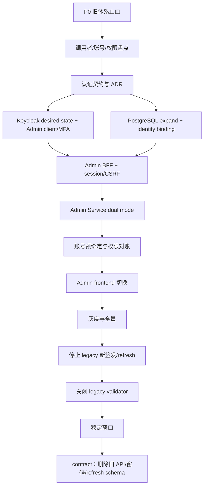

# 07. 排序后的任务清单与版本建议

实施状态：**规划与排序；注释变更不代表任务完成，清单中的实施项仍全部待处理**

## 1. 排序原则

任务不是按“哪个模块最容易改”排序，而是按风险和依赖排序：

1. 先修复当前正在暴露的风险，不能以“马上迁 Keycloak”为理由延期。
2. 先冻结身份、角色、API 和版本契约，再创建 client/Schema。
3. 数据和服务端先兼容，前端后切换。
4. 先停止旧体系的新签发，再停止验证。
5. 删除旧字段/API 是最后的 contract 阶段，与首次切换分开发版。

## 2. 总体关键路径



关键路径上的任何节点未验收，后续节点不得标记完成。

## 3. 优先级定义

| 优先级 | 含义 | 发版要求 |
| --- | --- | --- |
| P0 | 当前可导致凭据泄漏、默认高权限账号、明确提权或会话失控 | 阻止生产发版 |
| P1 | 认证统一主路径和必要安全边界 | `v1.3.0` 必须完成 |
| P2 | 运营、自动化 provisioning、防御纵深 | 可在 `v1.3.x/v1.4.0` |
| P3 | 长期 audience、机器身份、零信任演进 | 后续专项，不阻塞首切 |

工作量仅用 S/M/L/XL 表示相对拆分规模，不承诺日历工期。

## 4. Wave 0：当前体系止血（目标 `v1.2.2`）

| 顺序 | ID | 优先级 | 工作 | 依赖 | 大小 | 验收摘要 |
| ---: | --- | --- | --- | --- | --- | --- |
| 1 | AUTH-001 | P0 | 登录、刷新、改密、建用户等 operation log 递归脱敏；排查历史秘密 | 无 | M | 新旧日志无 password/token；完成轮换与事件记录 |
| 2 | AUTH-002 | P0 | 移除 `admin/Admin@123` 固定 seed；生产清理默认/测试用户 | 无 | M | fresh seed 不产生已知凭据；生产盘点为零 |
| 3 | AUTH-003 | P0 | 修复 `super_admin` 分配、修改、删除、最后一人和并发保护 | 无 | L | 非 super 无法提权；最后一名 super 不可并发移除 |
| 4 | AUTH-004 | P1 | 修复 Admin 前端无 refresh token 永久队列、并发刷新、半登录和注销撤销竞态 | AUTH-001 | M | 并发/失败/logout 行为测试全绿 |
| 5 | AUTH-005 | P1 | legacy 登录/刷新限流、稳定错误码、JWT algorithm/issuer/audience 或明确内部契约加固 | AUTH-001 | L | 暴力尝试受控；错误 token 矩阵通过 |
| 6 | AUTH-006 | P1 | 安全开关 fail closed；生产配置缺失启动失败 | 无 | M | property 缺失不 permit-all；local/test 才能显式关闭 |
| 7 | AUTH-007 | P1 | 生产 Keycloak 移除 dev users，真实 redirect URI/preflight 和 realm drift 检查 | AUTH-002 | L | fresh production realm 无测试用户且 HTTPS 登录成功 |

这组工作保持现有认证体验和主要 API 兼容，适合补丁版本。它们不是统一认证的替代品，而是让迁移窗口内的旧体系不继续扩大风险。

## 5. Wave 1：发现、契约和 ADR（`v1.3.0` 前置）

| 顺序 | ID | 优先级 | 工作 | 依赖 | 大小 | 主要产物/验收 |
| ---: | --- | --- | --- | --- | --- | --- |
| 8 | AUTH-100 | P1 | 盘点 `/auth/login/refresh/password` 全部调用者 | Wave 0 | S | 日志+代码+owner 清单，区分内部/外部契约 |
| 9 | AUTH-101 | P1 | 盘点 active Admin users、共享/服务/默认账号、角色、最近登录和 MFA 能力 | AUTH-002 | M | 每账号分类 A–F，有 owner 和迁移决定 |
| 10 | AUTH-102 | P1 | 冻结 token contract：issuer、client、audience、role path、401/403/503 | AUTH-100 | M | 安全/服务 owner 签字的 ADR 和 token fixture |
| 11 | AUTH-103 | P1 | 冻结 BFF、session store、Cookie/CSRF、logout/step-up ADR | AUTH-102 | M | 选择 PostgreSQL/Redis、TTL、Cookie、CSRF 和故障语义 |
| 12 | AUTH-104 | P1 | 冻结身份字段所有权和 user management 产品流程 | AUTH-101 | M | username/email/password/avatar/disable/删除责任矩阵 |
| 13 | AUTH-105 | P1 | 确认域名、TLS、网络和是否同 realm/独立 realm | AUTH-102 | S | Admin/IdP origins、信任边界和法规确认 |

这一阶段不应写成一张泛泛的设计 ticket。每项都必须产生可测试的稳定契约。

## 6. Wave 2：Keycloak 与数据层 Expand

| 顺序 | ID | 优先级 | 工作 | 依赖 | 大小 | 主要验收 |
| ---: | --- | --- | --- | --- | --- | --- |
| 14 | AUTH-110 | P1 | 建立版本化 Keycloak desired-state migration，不依赖启动 import 更新 | AUTH-102, AUTH-105 | L | 幂等 apply、diff、备份/恢复、drift CI |
| 15 | AUTH-111 | P1 | 新建 confidential `skytrace-admin`、`skytrace-admin-api` resource/audience 与准入 role、exact callback | AUTH-110 | M | 业务 token不含 Admin audience；redirect负向测试 |
| 16 | AUTH-112 | P1 | 管理专用 MFA browser flow、恢复码、session/token policy | AUTH-111 | L | WebAuthn/TOTP E2E；业务 SSO 不能跳过管理 MFA |
| 17 | AUTH-113 | P1 | 清理 `fullScopeAllowed`、service account 和 role 继承 | AUTH-110 | M | token claim diff 符合最小权限 |
| 18 | AUTH-120 | P1 | Prisma additive migration：identity binding、OIDC session、审计字段/索引 | AUTH-103, AUTH-104 | L | 空库/升级/旧 binary兼容；无明文 token |
| 19 | AUTH-121 | P1 | session token 加密、key version、清理与轮换机制 | AUTH-120 | L | current/previous key、重加密、故障测试 |
| 20 | AUTH-122 | P1 | 绑定 dry-run/import/report 工具与双人审批流程 | AUTH-101, AUTH-120 | L | 零自动 username/email 绑定；冲突可报告不可写入 |

AUTH-110–113 与 AUTH-120–122 可以由不同团队并行，但都依赖已冻结契约，且最终在 BFF 集成前汇合。

## 7. Wave 3：Admin Service BFF 与 Dual 模式

| 顺序 | ID | 优先级 | 工作 | 依赖 | 大小 | 主要验收 |
| ---: | --- | --- | --- | --- | --- | --- |
| 21 | AUTH-130 | P1 | OIDC confidential client：login/state/nonce/PKCE/callback/token validation | AUTH-111, AUTH-120, AUTH-121 | XL | callback 攻击矩阵、真实 Keycloak E2E |
| 22 | AUTH-131 | P1 | opaque Cookie session、idle/absolute TTL、rotation、并发 refresh | AUTH-103, AUTH-121, AUTH-130 | XL | 20 并发只刷新一次；Cookie/session fixation测试 |
| 23 | AUTH-132 | P1 | CSRF、Origin、同源 CORS、no-store | AUTH-131 | L | 所有写请求负向 CSRF 测试通过 |
| 24 | AUTH-133 | P1 | `(iss, sub)` principal 映射本地 user、status 与 RBAC | AUTH-122, AUTH-130 | L | 改名不换人；未绑定/禁用/权限拒绝正确 |
| 25 | AUTH-134 | P1 | `legacy|dual|oidc-bff` 显式模式和隔离 verifier | AUTH-130, AUTH-133 | L | HS/RS confusion、错误模式和跨 token矩阵 |
| 26 | AUTH-135 | P1 | 新 `/auth/session`、OIDC logout、step-up；保持 `/auth/me` 兼容 | AUTH-131, AUTH-133 | L | API snapshot、logout 局部失败语义 |
| 27 | AUTH-136 | P1 | Admin controller 改为全局 fail-closed，公开 route显式标记 | AUTH-134 | M | route inventory 证明无漏 guard |
| 28 | AUTH-137 | P1 | 结构化认证日志、metrics、告警、session admin能力 | AUTH-131, AUTH-134 | L | 无 secrets/高基数；runbook 演练 |

建议 PR 拆分：token/claim validator、Schema/session crypto、OIDC transaction、Cookie/CSRF、identity/RBAC、dual mode/API、observability 分开审查；不要把全部放进一个不可审计 PR。

## 8. Wave 4：Admin Frontend 与账号迁移

| 顺序 | ID | 优先级 | 工作 | 依赖 | 大小 | 主要验收 |
| ---: | --- | --- | --- | --- | --- | --- |
| 29 | AUTH-140 | P1 | 新 Admin session state machine、运行时 auth mode、错误页 | AUTH-135 | L | booting/anonymous/forbidden/unavailable 行为测试 |
| 30 | AUTH-141 | P1 | Axios 改 Cookie + CSRF；upload 等旁路统一 | AUTH-132, AUTH-140 | M | 无 Authorization/local refresh；跨 origin header 拒绝 |
| 31 | AUTH-142 | P1 | 移除 token persist、清旧 localStorage、多标签 logout | AUTH-140 | M | storage 扫描为零；BroadcastChannel E2E |
| 32 | AUTH-143 | P1 | 登录页改统一登录；深链、切换账号、错误恢复 | AUTH-140 | M | 无密码输入；return path 攻击测试 |
| 33 | AUTH-144 | P1 | 密码/用户管理 UX 拆分；Keycloak account action | AUTH-104, AUTH-143 | L | SPA 不收集本地密码；字段所有权一致 |
| 34 | AUTH-145 | P1 | 生产 CSP、安全 headers、Admin exact origin和代理配置 | AUTH-105, AUTH-141 | M | 浏览器 header/CSP/上传/API 测试 |
| 35 | AUTH-146 | P1 | 执行账号预绑定、MFA enrolment、legacy/OIDC 权限快照对账 | AUTH-112, AUTH-122, AUTH-133 | L | active 用户 100% 有迁移结论，零权限扩大 |

## 9. Wave 5：测试、发布与切换

| 顺序 | ID | 优先级 | 工作 | 依赖 | 大小 | 主要验收 |
| ---: | --- | --- | --- | --- | --- | --- |
| 36 | AUTH-150 | P1 | 单元、集成、真实 Keycloak、浏览器和安全测试矩阵 | Waves 2–4 | XL | `06` 文档中的必要场景全部有证据 |
| 37 | AUTH-151 | P1 | fresh staging、HA、故障、key/secret rotation、备份恢复 | AUTH-150 | L | 无手工修 realm；恢复和回滚演练通过 |
| 38 | AUTH-152 | P1 | `v1.3.0-rc.1` canary，至少两个 super admin | AUTH-146, AUTH-151 | M | 完整刷新周期内无错绑/越权/循环 |
| 39 | AUTH-153 | P1 | 全量 Admin frontend 切 BFF，Admin Service保持 dual | AUTH-152 | M | auth source、错误率、权限快照达标 |
| 40 | AUTH-154 | P1 | 停止 official UI 使用 legacy；发布弃用通知 | AUTH-153 | S | legacy UI 流量为零；外部调用者逐项确认 |

## 10. Wave 6：Legacy 收口与 Contract

| 顺序 | ID | 优先级 | 工作 | 依赖 | 目标版本 | 主要验收 |
| ---: | --- | --- | --- | --- | --- | --- |
| 41 | AUTH-160 | P1 | 停止新 legacy login/refresh 签发（按调用者契约） | AUTH-154, AUTH-100 | `1.3.x` 或 `2.0.0` | DB refresh row 不再增加 |
| 42 | AUTH-161 | P1 | 主动撤销旧 refresh，等待最大 access TTL + 缓冲 | AUTH-160 | 同上 | legacy validator 命中归零 |
| 43 | AUTH-162 | P1 | 关闭 legacy validator，撤出旧 secrets | AUTH-161 | 同上 | 任何 HS token 均拒绝；secret inventory清零 |
| 44 | AUTH-170 | P2 | `password` nullable -> hash 清理 -> 字段删除 | AUTH-162 + 稳定窗口 | `2.0.0` 默认 | 旧 binary 不再需要；备份恢复通过 |
| 45 | AUTH-171 | P2 | 删除 `RefreshToken` model/table 与清理任务 | AUTH-162 | `2.0.0` 默认 | 无旧 session/metrics依赖 |
| 46 | AUTH-172 | P2 | 删除 login/refresh/password legacy API、Local/JWT strategy | AUTH-162, AUTH-100 | `2.0.0` 默认 | 迁移客户端 100%；410窗口完成 |
| 47 | AUTH-173 | P2 | 删除 dual mode 和临时 SPA client（如曾使用） | AUTH-170–172 | `2.0.0`/后续 minor | desired state、代码、secret 无遗留 |

如果 AUTH-100 以证据证明旧 API 从未作为外部/版本化契约，只由同版本 Admin SPA 使用，AUTH-160–173 可以在批准的后续 minor 中完成；否则删除/禁用属于 breaking change，放到 `v2.0.0`。

## 11. Wave 7：非首切前置的后续能力

| ID | 优先级 | 工作 | 目标方向 |
| --- | --- | --- | --- |
| AUTH-200 | P2 | Keycloak Admin API 最小权限 provisioner + outbox/reconciliation | `v1.4.0` 候选 |
| AUTH-201 | P2 | back-channel logout、`sid` session 索引与即时断开 | `v1.3.x/v1.4.0` |
| AUTH-202 | P2 | 管理高风险动作统一 step-up policy | `v1.4.0` |
| AUTH-203 | P2 | 管理员定期 access review 自动报表 | `v1.4.0` |
| AUTH-204 | P2 | Admin Service 多实例 session/permission cache 验证 | 横向扩展前 |
| AUTH-300 | P3 | 业务 client 与 `skytrace-business-api` audience 解耦 | 单独兼容迁移 |
| AUTH-301 | P3 | 业务 realm roles 迁到 resource client roles | AUTH-300 后 |
| AUTH-302 | P3 | 机器 workload identity、细分 audience/scope、密钥认证 | 自动化增长前 |
| AUTH-303 | P3 | 独立 Admin realm/instance 的合规与故障域评估 | 风险/法规触发 |

详细原则见 [08. 后续演进方向](08-future-directions.md)。

## 12. 建议 PR 顺序

为便于代码评审和回滚，推荐按以下 PR 边界；编号不等于 GitHub 已有 PR：

1. `auth/hotfix-secret-redaction`
2. `auth/hotfix-default-identities`
3. `auth/hotfix-super-admin-boundary`
4. `auth/hotfix-legacy-session-client`
5. `auth/adr-contracts-and-inventory`
6. `auth/keycloak-desired-state-admin-client`
7. `auth/prisma-expand-identity-session`
8. `auth/admin-token-validator-and-dual-mode`
9. `auth/admin-oidc-transaction`
10. `auth/admin-session-cookie-csrf`
11. `auth/identity-binding-rbac`
12. `auth/admin-api-session-me-logout`
13. `auth/frontend-bff-session`
14. `auth/frontend-account-ux`
15. `auth/observability-and-runbooks`
16. `auth/integration-e2e-security-tests`
17. `auth/canary-cutover`
18. `auth/legacy-stop-issue`
19. `auth/contract-cleanup`（独立后续版本）

Keycloak desired state、Prisma migration、Admin Service 和 Admin frontend 可以分别 PR，但 release manifest 必须声明兼容组合。

## 13. 版本建议

### 本次文档

不改产品版本号，不打产品 release tag。可以合并“文档 + 注释”commit；这些变更没有改变运行行为。

### `v1.2.2`

范围：Wave 0 的兼容性安全修复。建议流程：

```text
v1.2.2-rc.1 -> fresh staging/安全回归 -> v1.2.2
```

不得把整个认证架构迁移硬塞进 `v1.2.2`，否则 patch 版本难以表达配置、Schema 和部署协同风险。

### `v1.3.0`

建议包含：

- 版本化 Admin Keycloak client/MFA 配置。
- additive identity/session Schema。
- Admin Service BFF 与 dual mode。
- identity binding 与本地 RBAC 兼容。
- Admin frontend 切换到 Cookie session。
- 完整测试、可观测性、灰度和回滚能力。
- 旧 API 标记 deprecated；是否停签取决于 AUTH-100 调用者清单。

发布序列：

```text
v1.3.0-alpha.1  集成环境验证 Schema/Keycloak/BFF
v1.3.0-beta.1   内部账号与权限对账
v1.3.0-rc.1     fresh staging + canary + 回滚演练
v1.3.0          official Admin frontend 默认 BFF
```

预发布数量按问题决定，不机械增加；`rc.1` 后有认证逻辑变更应发新的 rc，不移动 tag。

### `v1.3.x`

只做兼容 bug、安全修复、观测改进和已设计的小范围收口。不要在 patch 中突然删除 legacy endpoint。

### `v1.4.0`

候选：自动 provisioning/outbox、back-channel logout、统一 step-up、access review，以及业务 audience 双读第一阶段。它们是新能力而非首切必需。

### `v2.0.0`

默认安排以下 breaking contract：

- 删除本地 password credential。
- 删除本地 refresh token table/协议。
- 删除 `/auth/login`、`/auth/refresh`、旧 `/auth/password`。
- 删除 legacy HS validator 和 secret。
- 如果同时移除旧业务 audience/realm-role contract，也在此完成最终 contract。

不要因为认证工作量大就机械升 major；只有对外兼容承诺被删除时才需要 major。如果调用者盘点证明旧 API 完全内部且已有可靠弃用窗口，可由发布委员会批准在 minor 收口。

## 14. 跨组件版本兼容矩阵

| Admin frontend | Admin Service | Keycloak config | 结果 |
| --- | --- | --- | --- |
| legacy | legacy | 当前 | 可用，但只限 `v1.2.2` 止血后 |
| legacy | dual | 新增 Admin client | 可用，迁移桥 |
| oidc-bff | dual | Admin client/MFA 已就绪 | 推荐切换组合 |
| oidc-bff | oidc-bff-only | Admin client/MFA 已就绪 | 旧流量归零后的目标 |
| oidc-bff | legacy | 任意 | 不兼容，部署 preflight 必须阻止 |
| legacy | oidc-bff-only | 任意 | 不兼容，部署 preflight 必须阻止 |

release manifest 需要逐服务写 image digest、Schema migration、Keycloak migration version 和 auth mode，不能只写一个统一 tag 就假设原子兼容。

## 15. 每项任务的完成定义

任何 AUTH 任务只有同时满足以下条件才算完成：

- 代码/配置/Schema 已合并且独立 reviewer批准。
- 单元、集成、负向安全和必要 E2E 通过。
- 文档、错误码、指标、告警和 runbook 更新。
- 没有 token/secret/PII 日志回归。
- fresh 环境可重复部署，不依赖控制台手改。
- 升级和回滚都演练。
- owner 和验收证据可追踪。
- 若改变 API/Schema/会话，release note 和兼容矩阵已更新。

本次仅创建方案文档并补充了源码注释，因此上表所有 AUTH 项当前状态仍是“未开始/待排期”，不能在项目管理系统中批量标记完成。

## 16. 最短可行执行顺序

如果团队只能一次处理少量工作，最低限度按这个顺序推进：

1. AUTH-001/002/003/004：先止血。
2. AUTH-100–105：把调用者、账号和契约说清楚。
3. AUTH-110–122：Keycloak 与数据层只做 additive。
4. AUTH-130–137：Admin Service dual+BFF。
5. AUTH-140–146：前端与账号迁移。
6. AUTH-150–153：真实测试、灰度、全量。
7. AUTH-160–162：逐步停旧体系。
8. AUTH-170–173：在后续版本 contract。

任何“先改前端登录页，之后再补身份映射/服务端 audience”的倒序方案都应被架构评审拒绝。
